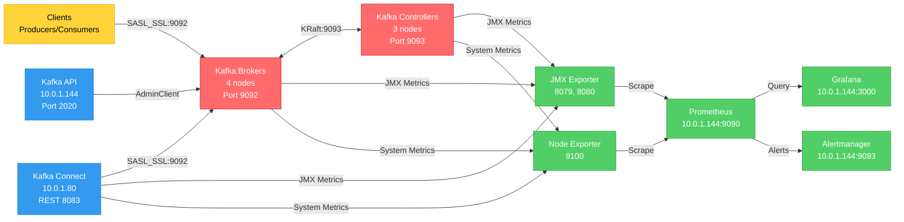

# Trendyol Data Streaming Case Study

## Overview

Production-ready Apache Kafka streaming platform implementing modern Platform Engineering practices. This project demonstrates end-to-end infrastructure automation, security, observability, and operational excellence for a highly available Kafka cluster on AWS.

**Duration**: 7.5 days
**Cloud Provider**: AWS (eu-central-1)
**Architecture**: Multi-AZ distributed deployment with KRaft mode

### Component Distribution

| Component                   | Count | Distribution                    | Instance Type | Purpose                         |
| --------------------------- | ----- | ------------------------------- | ------------- | ------------------------------- |
| **Kafka Brokers**     | 4     | 2 in AZ-1, 2 in AZ-2            | t3.small      | Data storage & message handling |
| **Kafka Controllers** | 3     | 1 in AZ-1, 1 in AZ-2, 1 in AZ-3 | t3.small      | KRaft metadata management       |
| **Kafka Connect**     | 1     | AZ-1                            | t3.small      | Connector cluster               |
| **Observability**     | 1     | AZ-1                            | t3.medium     | Prometheus, Grafana, API        |

**Total Infrastructure**: 9 EC2 instances across 3 availability zones

---

## Architecture Diagram



## Technology Stack

### Infrastructure & Automation

- **IaC**: Terraform 1.0+
- **Configuration Management**: Ansible + cp-ansible (Confluent Platform)
- **Cloud Provider**: AWS
- **Containerization**: Docker + Docker Compose

### Kafka Ecosystem

- **Kafka Version**: 8.1.0 (Confluent Platform)
- **Mode**: KRaft (No ZooKeeper)
- **Security**: SASL_SSL + SCRAM-SHA-512
- **Connectors**: Datagen Source Connector

### Observability

- **Metrics**: Prometheus + JMX Exporter + Node Exporter
- **Visualization**: Grafana
- **Alerting**: Alertmanager
- **Monitoring Coverage**: Infrastructure + Kafka + Kafka Connect

### API & Development

- **Language**: Python 3.9
- **Framework**: Flask 3.0.0
- **Kafka Client**: confluent-kafka 2.3.0

---

## Quick Start

### Prerequisites

- AWS CLI configured with credentials
- Terraform >= 1.0
- Ansible >= 2.9
- AWS Key Pair named `kafka-key` in eu-central-1
- SSH access to provisioned instances

### Deployment Steps

#### Provision Infrastructure

```bash
cd "1. Infrastructure-as-Code-with-Terraform"
terraform init
terraform plan
terraform apply
terraform output  # Note down IP addresses
```

#### Deploy Kafka Cluster

```bash
cd "../2.Kafka-Cluster-Setup-and-Configuration/ansible"
# Update hosts.yml with IPs from terraform output
ansible all -m ping
ansible-playbook -i hosts.yml confluent.platform.all
```

#### Setup Observability

```bash
# Install node_exporter on all nodes
cd "../../3-observability/node_exporter"
ansible-playbook -i hosts.yml install-node-exporter.yml

# Deploy monitoring stack
ssh ubuntu@<observability-ip>
cd 3-observability
docker-compose up -d
```

**Access URLs:**

- Grafana: http://`<observability-ip>`:3000 (admin/admin)
- Prometheus: http://`<observability-ip>`:9090

#### Deploy REST API

```bash
ssh ubuntu@<observability-ip>
cd 4-operation-excellence/kafka-api
docker build -t kafka-rest-api:latest .
docker run -d --name kafka-api -p 2020:2020 kafka-rest-api:latest
```

**Test API:**

```bash
curl http://<observability-ip>:2020/health
curl http://<observability-ip>:2020/brokers
```

#### Deploy Kafka Connect

```bash
ssh ubuntu@<connect-ip>
cd 5-kafka-connect-cluster-deployment
docker compose up -d --build
curl http://localhost:8083/ | jq
```

---

## Detailed Sections

Each section has comprehensive documentation in its respective README.md:

### Section 1: Infrastructure as Code with Terraform

**Path**: `1. Infrastructure-as-Code-with-Terraform/README.md`

- VPC and networking setup
- Multi-AZ subnet configuration
- EC2 instance provisioning
- Security group rules
- Module architecture

**Key Outputs**: Broker IPs, Controller IPs, Connect IP, Observability IP

---

### Section 2: Kafka Cluster Setup and Configuration

**Path**: `2.Kafka-Cluster-Setup-and-Configuration/README.md`

- KRaft mode cluster deployment
- SASL_SSL security configuration
- Rack awareness across AZs
- JMX exporter setup
- Post-deployment verification

**Security**: SCRAM-SHA-512 authentication, SSL/TLS encryption

---

### Section 3: Observability Stack

**Path**: `3-observability/README.md`

- Prometheus metrics collection
- Grafana dashboard provisioning
- Node exporter deployment
- Alert rules for critical issues

**Dashboards**: Broker metrics, Controller metrics, Connect metrics

---

### Section 4: Operation Excellence

**Path**: `4-operation-excellence/README.md`

- REST API for Kafka management
- Topic CRUD operations
- Consumer group monitoring
- Docker deployment
- Production-ready error handling

**Endpoints**: `/brokers`, `/topics`, `/consumer-groups`

---

### Section 5: Kafka Connect Cluster

**Path**: `5-kafka-connect-cluster-deployment/README.md`

- Distributed Connect deployment
- Datagen connector setup
- REST API operations
- JMX monitoring integration
- Connector management

**Connectors**: Datagen Source, HTTP Source (example)

## Design Decisions

### 1. KRaft Mode (No ZooKeeper)

**Rationale**: Modern Kafka architecture, simplified operations, better scalability

### 2. Separated Controller/Broker Roles

**Rationale**: Dedicated controllers improve metadata management and cluster stability

### 3. SCRAM-SHA-512 Authentication

**Rationale**: Strong authentication without external dependencies (vs. Kerberos)

### 4. Self-Signed Certificates

**Rationale**: Simplified initial deployment; production should use CA-signed certificates

### 5. Docker Compose for Services

**Rationale**: Easy deployment, version control, and reproducibility

### 6. Public Subnets

**Rationale**: Simplified access for case study; production should use private subnets with NAT

### 7. Modular Terraform Structure

**Rationale**: Separation of concerns (network, compute, security) for maintainability

### 8. Confluent Platform Ansible

**Rationale**: Official, well-maintained, production-ready deployment automation

---

## Security

### Authentication & Authorization

- **Mechanism**: SASL SCRAM-SHA-512
- **Users**: admin, client, kafka_connect
- **Inter-broker**: SCRAM authentication

### Encryption

- **Protocol**: SASL_SSL
- **Certificates**: Self-signed CA generated by cp-ansible
- **Coverage**: All broker, controller, and client communications

### Network Security

- **Security Groups**: Firewall rules for port access
- **SSH**: Key-based authentication only
- **Internal Traffic**: Self-referencing security group

### Production Recommendations

⚠️ Use CA-signed certificates
⚠️ Implement RBAC with ACLs
⚠️ Restrict SSH to bastion host
⚠️ Use private subnets with NAT Gateway
⚠️ Enable VPC Flow Logs
⚠️ Implement secrets management (AWS Secrets Manager)
⚠️ Regular credential rotation

---

## Monitoring

### Metrics Coverage

**Infrastructure (Node Exporter)**

- CPU usage, memory usage, disk space
- Network I/O, system load

**Kafka Brokers (JMX)**

- Partition count, under-replicated partitions
- Bytes in/out per second, request rate
- Disk usage, CPU, memory

**Kafka Connect (JMX)**

- Connector status (running/failed)
- Task status, worker count
- Producer metrics, heap usage

## Troubleshooting

### Common Issues

#### Terraform apply fails

**Check**: AWS credentials, key pair existence, service quotas

#### Ansible playbook fails

**Check**: SSH connectivity, inventory IPs, Python on remote hosts

#### Kafka cluster not forming

**Check**: Security group rules, controller quorum voters, SASL credentials

#### Prometheus targets down

**Check**: JMX exporter running, firewall rules, connectivity

#### Connect fails to start

**Check**: SSL certificates, Kafka connectivity, SASL credentials

### Verification Commands

```bash
# Check Kafka broker
ssh ubuntu@<broker-ip>
sudo systemctl status confluent-kafka
sudo journalctl -u confluent-kafka -n 50

# Check controller
ssh ubuntu@<controller-ip>
sudo systemctl status confluent-kcontroller

# Test Kafka connection
kafka-topics --list --bootstrap-server <broker-ip>:9092 \
  --command-config /etc/kafka/client.properties

# Check Prometheus targets
curl http://<observability-ip>:9090/api/v1/targets | jq

# Check Connect
curl http://<connect-ip>:8083/ | jq
```

### Log Locations

- **Kafka Brokers**: `/var/log/kafka/`
- **Controllers**: `/var/log/controller/`
- **Connect**: `docker logs kafka-connect`
- **Prometheus**: `docker logs prometheus`
- **Grafana**: `docker logs grafana`

---

## Documentation

Each section contains detailed README.md files:

- ✅ **Section 1**: Infrastructure provisioning and Terraform modules
- ✅ **Section 2**: Kafka cluster deployment and security configuration
- ✅ **Section 3**: Observability stack setup and dashboard configuration
- ✅ **Section 4**: REST API deployment and endpoint documentation
- ✅ **Section 5**: Kafka Connect deployment and connector management

## Contact & Repository

**Repository**: [github.com/bunyaminonum/trendyol-kafka-case](https://github.com/bunyaminonum/trendyol-kafka-case)

**Author**: Bunyamin Onum

---

**Thank you for reviewing this case study!**

For detailed deployment instructions, please refer to individual section README files.
